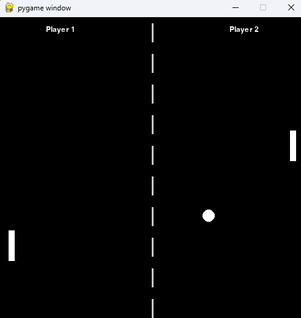
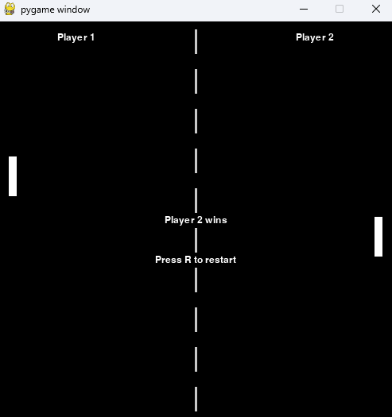

# Pong_PyGame
Pong in PyGame.

Game Controls:

Player 1:  
W : UP  
S : DOWN  

Player 2:  
UP ARROW : UP  
DOWN ARROW " DOWN  

R : Restart once win condition met

Game while running:

Game End Screen:

